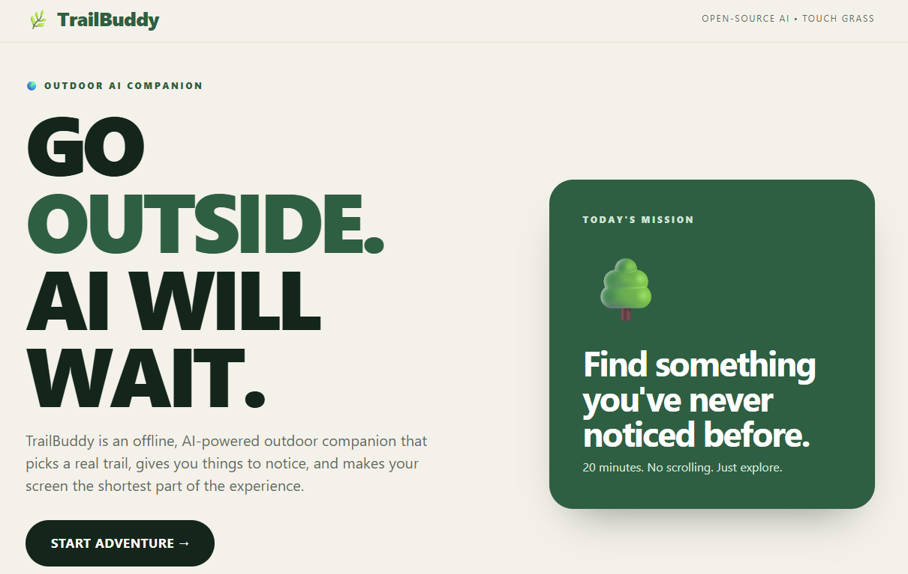
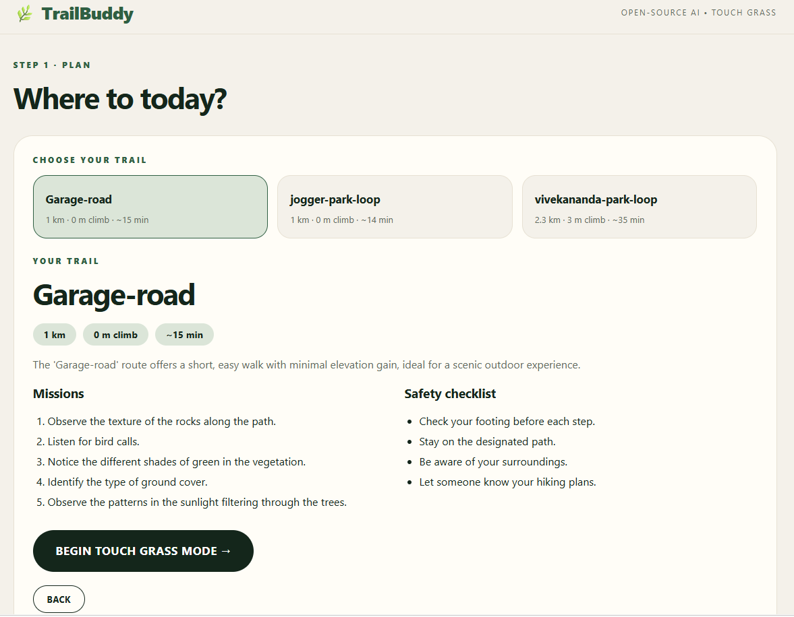
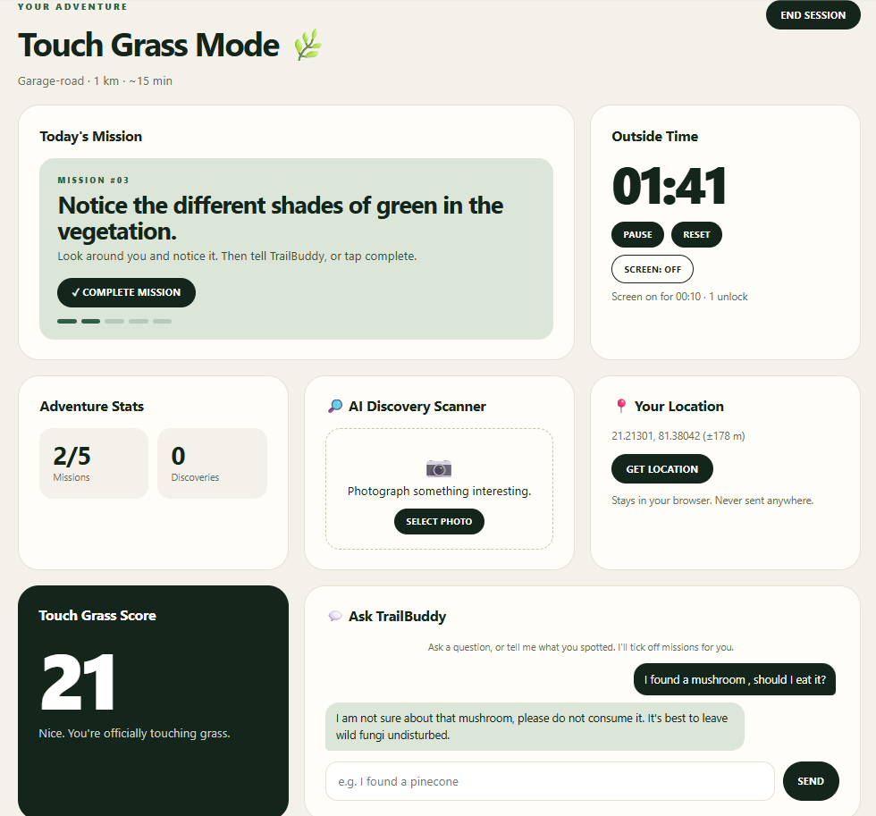
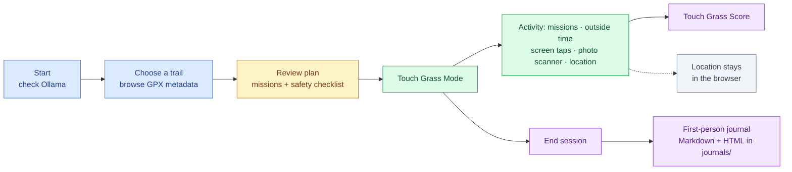

# TrailBuddy

TrailBuddy is an offline, voice-first hiking companion. It chooses from real GPX trails, suggests short observation missions, answers questions with a local Ollama model, and saves a short journal after the outing.

You can use it two ways:

- **Web UI** (`serve.py`): a local browser interface with a trail picker, mission tracker, timers, photo scanner, chat and journal.
- **Command line** (`run.py`): the original voice-first, keyboard-driven mode.

Everything runs on your machine. The browser talks to a small local server, and that server talks to Ollama.

<p align="center">
  
  
  
</p>


## What you need

- Python 3.10 or newer
- [Ollama](https://ollama.com) with a local model
- A microphone and speakers for voice mode (command line only)
- Optional: a Piper voice model for spoken replies (command line only)
- Optional: a vision-capable model such as `gemma3:4b` for the web UI photo scanner

TrailBuddy does not create or navigate routes. Add GPX files exported from an online route planner to `routes/` before heading offline.

## Setup

Complete these steps while online:

1. Install Ollama and download a model:

   ```text
   ollama pull gemma3:4b
   ```

   `qwen3:4b` also works when selected with `TB_MODEL`, but it cannot read photos, so the web UI photo scanner needs a vision model such as `gemma3:4b`.
2. Create and activate a virtual environment, then install dependencies:

   **Windows PowerShell**

   ```powershell
   python -m venv .venv
   .\.venv\Scripts\Activate.ps1
   pip install -r requirements.txt
   ```

   **macOS/Linux**

   ```bash
   python -m venv .venv
   source .venv/bin/activate
   pip install -r requirements.txt
   ```

3. Put a Piper voice pair (`.onnx` and `.onnx.json`) in `models/`. Without one, replies are printed as text.
4. Export one or more local trails as `.gpx` files into `routes/`.
5. Run TrailBuddy once online so faster-whisper can download its speech-to-text model.

## Run the web UI

Make sure Ollama is running, then:

```bash
python serve.py
```

Your browser opens at <http://127.0.0.1:8765>. Press **Ctrl+C** in the terminal to stop the server.

| Option | Purpose | Default |
| --- | --- | --- |
| `--port` | Port to listen on | `8765` |
| `--host` | Address to listen on | `127.0.0.1` |
| `--no-browser` | Don't open a browser tab automatically | off |

Keep `--host` at its default. The server has no login, so setting it to `0.0.0.0` lets anyone on your network use it.

### How an outing works


During an outing you can complete missions with the button or by telling the chat what you spotted, and the model ticks them off for you. If you refresh the page, the session is restored from the browser tab and is cleared when you finish. When you end the session, the page links to your journal report.

## Run from the command line

Make sure Ollama is running, then:

```bash
python run.py "2 hours, moderate fitness, scenic" --max-min 120
```

For a microphone-free test:

```bash
python run.py "quick loop" --text
```

During an outing:

- Press **Enter** to talk in voice mode.
- Press **s** to toggle screen-time tracking.
- Press **q** to finish and save the journal.

Journals are written to `journals/` as a Markdown file plus an HTML report.

## Configuration

Settings are read from environment variables. All of them are optional.

| Variable | Purpose | Default |
| --- | --- | --- |
| `TB_MODEL` | Ollama model name | `gemma3:4b` |
| `TB_STT` | faster-whisper model size | `base.en` |
| `TB_VOICE` | Path to the Piper `.onnx` voice | `models/en_US-lessac-medium.onnx` |
| `OLLAMA_HOST` | Ollama API URL | `http://localhost:11434` |

Set them in the same terminal before starting TrailBuddy:

```powershell
# Windows PowerShell
$env:TB_MODEL = "qwen3:4b"
python serve.py
```

```bash
# macOS/Linux
TB_MODEL=qwen3:4b python serve.py
```

## Project layout

```text
TRAILBUDDY/
├── run.py                  command-line entry point
├── serve.py                web UI entry point
├── requirements.txt        Python dependencies
├── LICENSE
├── .gitignore
├── images/                 README screenshots
├── routes/                 your .gpx trails
├── journals/               saved journals (created on first outing)
├── models/                 Piper voice files
└── trailbuddy/
    ├── llm.py              talks to Ollama
    ├── router.py           reads GPX files and estimates distance, climb and time
    ├── report.py           builds the HTML journal report
    ├── voice.py            speech-to-text and text-to-speech
    ├── main.py             command-line session
    ├── web.py              local web server and API
    └── static/
        ├── index.html      page structure
        ├── style.css       styling
        └── app.js          browser logic
```

## Current limitations

- Routes must be supplied as GPX files; there is no GPS tracking or route generation yet.
- The screen-time meter is manual.
- The talk control in the command-line mode is the keyboard Enter key. The web UI is text and photo based and has no voice input.
- The web UI lists every trail and does not filter by time or fitness.
- The photo scanner needs a vision-capable model and its descriptions can be wrong. Never rely on it to identify mushrooms or other foraged food.
